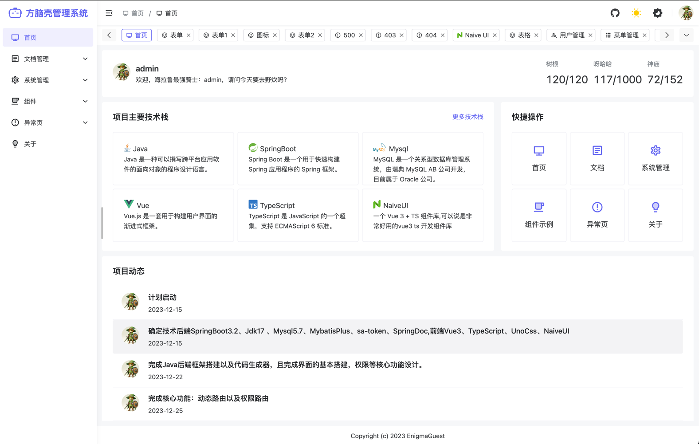
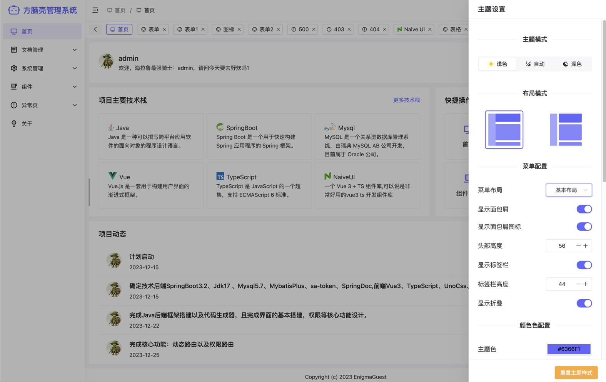
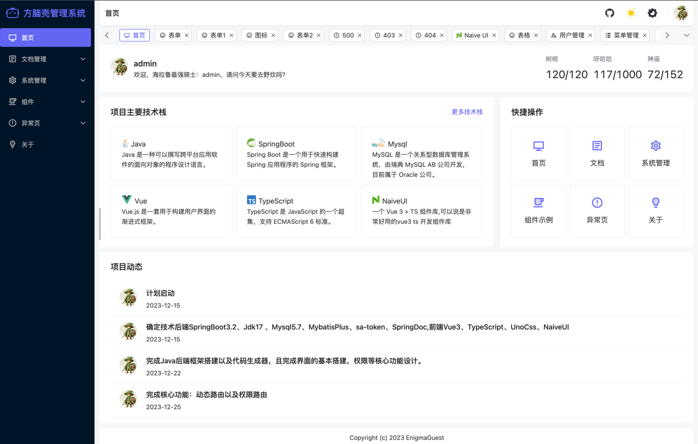
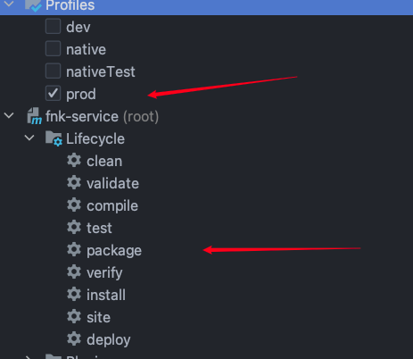
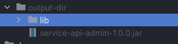

# 项目说明

方脑壳后台管理系统后端采用SpringBoot3.2.0全家桶前端使用vue3+ts+unocss+pinia+axios等构建而成，附带权限管理和代码生成器的实现。是一个前后端一体的开发脚手架，可以直接开箱即用。代码生成适配本前端界面的vue代码，让你的开发起飞～

## 项目截图






## 项目特点

- SpringBoot3.2.0全家桶
    - springboot3.2.0
    - java17
    - mybatis-plus
    - hutool
    - sa-token
- 前后端一体开发
- 权限管理
- 代码生成器
- 前端使用vue3+ts+unocss+pinia+axios等构建而成
    - 使用pnpm管理依赖
    - 使用vite构建项目
    - 使用unocss进行样式管理
    - 使用naive-ui组件库
    - 使用vue-router进行路由管理
    - 使用pinia进行状态管理,且实现加密持久化
    - 图标使用iconify进行管理
    - svg图标使用[icones](https://icones.js.org/collection/all)进行管理
    - 可显示本地svg图标且可动态修改颜色
    - 动态标签页可左右拖动以及右键菜单
    - 自定义主题
    - 部分组件（表单，列表,icon）抽取

## 项目结构

```bash
├── frontend # 前端项目
├── service-api # 服务接口
├── service-common # 服务公共模块
├── service-common-db # 服务数据库模块
├── service-common-bean # 公共bean模块
├── service-common-tools # 公共工具模块
├── service-code-generator # 代码生成器
├── service-core # 服务核心模块
├── service-core-base # 核心基础模块
├── service-core-system # 系统模块
├── pom.xml # 父pom
├── service.sql # 数据库脚本
└── README.md # 项目说明
```

## 项目运行

### 后端运行

- 导入数据库脚本
- 修改数据库配置-`service-core-base/src/main/resources/application.yml`
- 运行`service-api->service-api-admin->AdminApiApplication`

```
注意 项目是聚合项目且实现了动态配置开发 请先查看pom.xml
```

### 前端项目运行

```bash
# 安装依赖
pnpm i
# 启动项目
pnpm run dev
# 打包项目
pnpm run build
```

## 打包
### maven命令打包
```bash
# 仅参考
mvn clean package -Dmaven.test.skip=true -Pprod
```
### idea打包


打包后的文件在 项目根目录下 dev文件或者prod文件中（根据自己配置output-dir）


## 问题沟通交流QQ交流群


# Tips

## svg动态颜色

需要把下载的svg填充的颜色数值替换成 currentColor 即可 fill="currentColor"

## 持续更新中...
